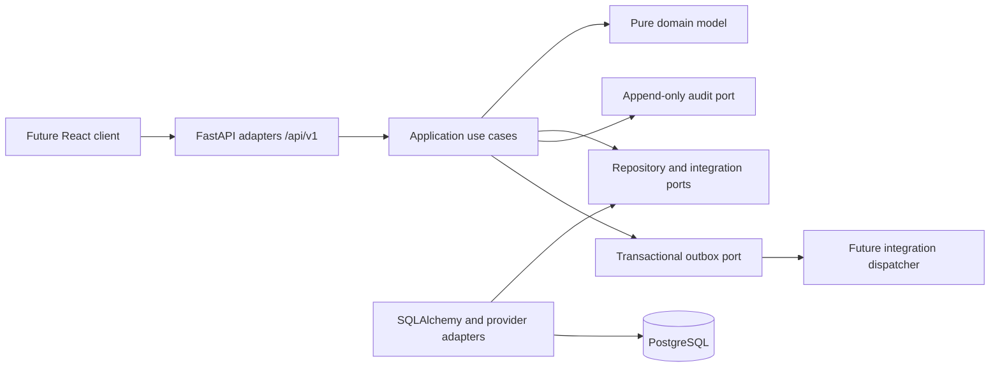

# Architecture

## Shape

Module 1 is one deployable modular monolith. Module boundaries provide ownership and dependency
rules without distributed transactions, service discovery, brokers, or operational duplication.



The dependency rule is `API -> application -> domain/ports <- infrastructure`. Domain and
application modules do not import FastAPI, SQLAlchemy, an OIDC provider, Camunda, or document
storage. The composition root is the only place that chooses concrete adapters.

## Packages

```text
app/
  main.py                    application composition and health endpoints
  core/
    config/                  validated SPK_* settings
    database/                SQLAlchemy base, async sessions, readiness
    security/                authentication port, dev and OIDC/JWT adapters
    errors/                  stable errors and centralized handlers
    logging/                 JSON logs and request/actor context
    audit/                   immutable audit domain, port, SQL adapter, API
    events/                  application events and transactional outbox
  modules/
    identity/                user-account identity
    access_control/          RBAC and organization scopes
    organization/            versions, units, arrows, positions, staffing, policy review
    employees/               people, employment, assignments, delegation
  shared/                    identifiers, time, envelopes, future integration ports
```

Each business module owns `domain`, `application`, `infrastructure`, and `api` packages. A module
may consume another module only through an application port. For example, employee assignment
uses a read-only staffing-slot snapshot port rather than an organization ORM object.

## Transactions and consistency

- Every mutation enters one explicit async unit of work.
- Aggregate change, audit event, and outbox event use the same SQLAlchemy session and commit.
- An exception rolls the transaction back; adapters do not hide unknown exceptions.
- Editable records use integer revisions. Updates include the expected revision in their SQL
  predicate; zero updated rows becomes `CONCURRENCY_CONFLICT`.
- Publication locks the relevant versions, revalidates the full candidate, closes the previous
  active interval, publishes the draft, writes audit/outbox entries, and commits once.
- Published structures and audit events are immutable. Temporal records are ended or archived,
  not physically deleted.

PostgreSQL foreign keys, checks, unique constraints, partial indexes, and effective-date indexes
provide a second line of defense. Business validation still runs before persistence so callers
receive domain-specific errors rather than database details.

## Authentication and authorization

Authentication is a port. The development header adapter is constructible only in the
`development` environment. The production adapter validates an OIDC JWT's signature, issuer,
audience, lifetime, and subject against provider JWKS. No passwords are stored.

Authorization is database-authoritative RBAC plus temporal scope:

```text
UserAccount -> UserRoleAssignment -> Role -> RolePermission -> Permission
                         |
                         +-> AccessScope(self / unit / descendants / selected / organization)
```

Use cases resolve the requested resource to its stored organization and unit before authorizing.
They never authorize a client-supplied unit ID in isolation, preventing ID substitution across
departments. The organization hierarchy adapter resolves descendant scope against the active or
historically requested structure.

## Data protection

- IIN is encrypted with a secret-managed Fernet key and stored as bytes.
- Sensitive person fields are absent from normal DTOs and require `employees.read_sensitive`.
- Audit sanitization removes token, password, IIN, and confidential-content keys recursively.
- Request logging records method, normalized path, status, latency, request ID, and actor ID—not
  bodies or authorization headers.
- UUIDs are identifiers; UTC `timestamptz` is used for instants and `date` for effective dates.

## Integration boundary

Application event names and payload versions are stable. The outbox intentionally has no broker
dispatcher in Module 1. Future modules can poll/claim outbox rows and implement the declared
workflow, document, signature, notification, employment-registry, and payroll ports without
changing current use cases.

## Deployment

The backend image runs as an unprivileged user. Migrations are an explicit release/startup step;
the web process never creates schema. Compose is provided for local PostgreSQL and the backend.
Kubernetes, microservices, and a message broker are intentionally absent from this MVP.
