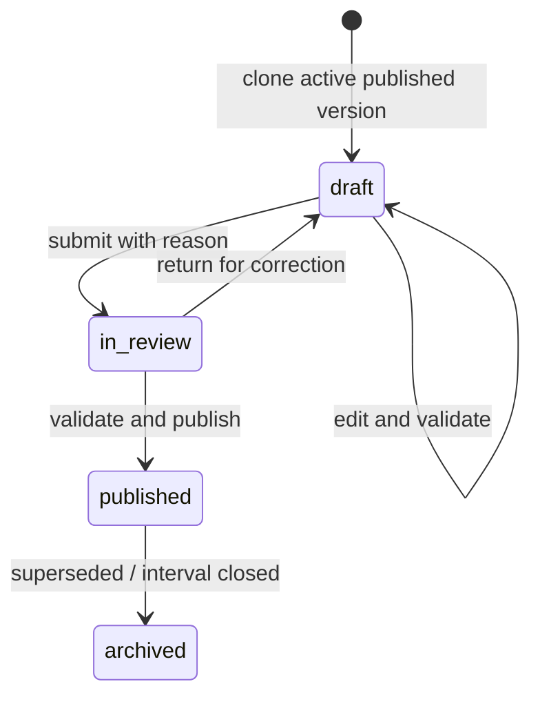

# Organization versioning

The organization chart is a versioned business record, not mutable global reference data. This
lets SPK demonstrate one structure, rename or reorganize it later, and still reproduce every
historical assignment, approval, and audit decision.

## Lifecycle

Only `draft` is editable. `in_review` freezes the candidate while reviewers decide. A returned
candidate increments revision and becomes editable again. Published/archived data is immutable.

The policy `structure_publish_requires_review` controls whether a valid draft may publish directly
or must first be in review. This policy is versioned and resolved by stable organization ID.

## Draft cloning

Creating a draft from the active published version:

1. locks/reads the base version;
2. allocates a new version UUID and next version number;
3. copies unit types/relationship references by ID;
4. clones units while retaining each `stableKey`;
5. remaps all parent UUIDs to the cloned units;
6. clones additional relationships and remaps endpoints;
7. clones staffing slots, retains slot stable keys, and remaps unit/reporting-slot UUIDs;
8. records `basedOnVersionId`, actor, audit event, and revision 1;
9. commits atomically.

The clone is a full candidate snapshot. Editing it cannot affect the active chart.

## Validation

Validation returns all discovered problems in deterministic order. It checks:

- exactly one root;
- no primary-tree cycles or orphan units;
- unit code uniqueness within the version;
- all references belong to the candidate version;
- valid relationship endpoints, dates, duplicates, cross-unit policy, and prohibited cycles;
- staffing-slot date/FTE/reference validity;
- no reporting-slot cycles;
- head-of-unit policy;
- existing assignment primary/FTE/date conflicts;
- at publication effective date, every ongoing or planned assignment still maps by slot
  `stableKey` to the same stable unit and position, an available date-compatible slot, and enough
  aggregate FTE in the candidate;
- delegation employee/date/self-reference validity;
- no reference from the candidate to a foreign structure version.

Editor operations run focused validation early (for example, moving a unit checks for a cycle),
then publication re-runs full validation to defend against concurrent or older drafts.

## Publication transaction

Publication requires `organization.structure.publish`, an expected revision, a non-empty reason,
and an effective date. In one PostgreSQL transaction it:

1. locks the candidate and relevant published version rows;
2. verifies candidate state/revision and applicable review policy;
3. re-runs full validation;
4. rejects silent transfer, removal, early closure, or FTE reduction for assignments that would
   remain effective after the new version starts;
5. rejects overlap with any published effective interval;
6. sets the previous active version's `effectiveTo` to the day before the new start and archives
   it when appropriate;
7. sets candidate status, `effectiveFrom`, publisher, and publication timestamp;
8. writes safe immutable audit records;
9. writes `organizationStructurePublished` to the outbox;
10. commits once.

No employee assignment, audit event, or historical version is rewritten. New operations resolve
the version active at their effective date. Because transfers are outside Module 1, a blocked
staffed-slot move requires explicitly ending the old assignment and creating the replacement
assignment before publication.

## Concurrency and parallel drafts

Multiple drafts may be prepared. Each version and editable structural record carries `revision`.
A write with a stale revision returns `CONCURRENCY_CONFLICT`. Two drafts cannot both publish for
the same effective interval: row locking, the service check, and database constraints/indexes
produce `ORG_STRUCTURE_VERSION_CONFLICT` for the loser.

## Comparison

Version comparison joins records by `stableKey`, not row UUID or display name. It reports added,
removed, moved, renamed, retyped, reordered, activated/deactivated, position/staffing, and graph
relationship changes. This keeps comparison meaningful after clone IDs change.
