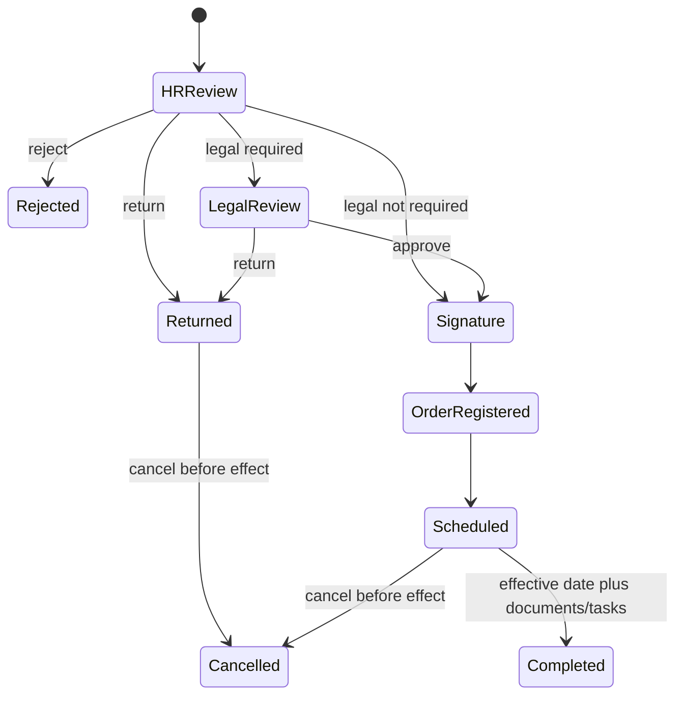

# Termination and offboarding

Self-service and authorized manager initiation resolve the employee's stored primary unit. HR and
conditional legal review can return or reject with a reason; the signer is a configured authority.
Registration links the controlled order document.

Future scheduling marks selected assignments `scheduled_end` without deactivating the employee or
revoking access. Every secondary assignment requires explicit `end` or `retain`. Completion requires
a validated mandatory document and handover, asset-return, access-revocation and settlement tasks
completed or waived by an authorized actor with a reason. Only at the effective point are scheduled
assignments ended and employee status changed. Pre-effective cancellation restores them; a legally
effective termination is immutable and needs a future corrective process.

Exit-interview restricted notes are never included in generic responses or audit. IAM, asset and
payroll confirmations remain explicit externally verifiable tasks.

Initiation starts the published termination workflow atomically and snapshots the subject employee,
unit and legal-review condition. Returned cases may be corrected and resubmitted only by the
original initiator. Read APIs expose explicit `self`, `unit`, and `all` scopes; unit filtering is
resolved through the stored authoritative primary assignment rather than a caller-supplied owner.
